# E-Ticaret Sitesi Örneği: TecHome
Proje, ana sayfa, ürün detay sayfası, sık sorulan sorular ve hakkımızda sayfası olmak üzere 4 kısımdan oluşmaktadır. Responsive bir yapıya sahiptir.

## Kullanılan Teknolojiler:
* HTML
* Scss
* Bootstrap
  
#### Ana Sayfa

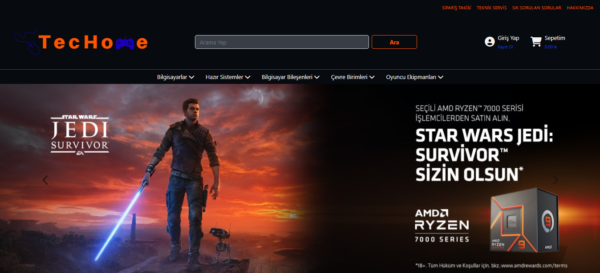

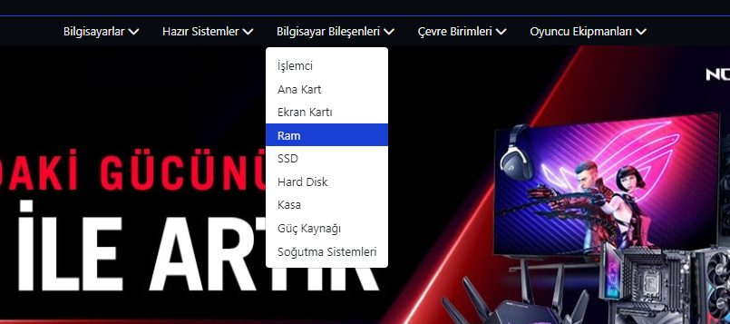

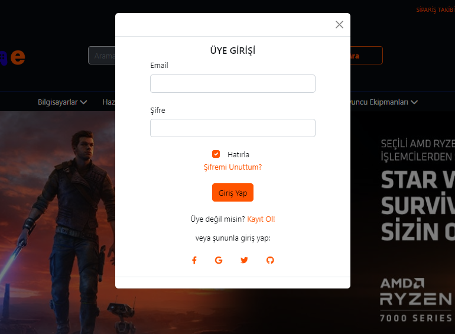

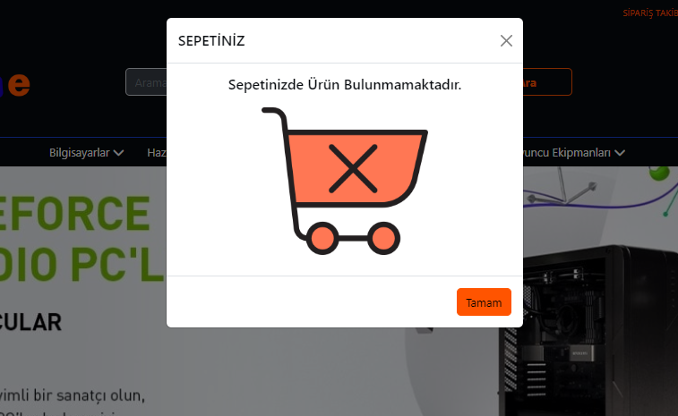

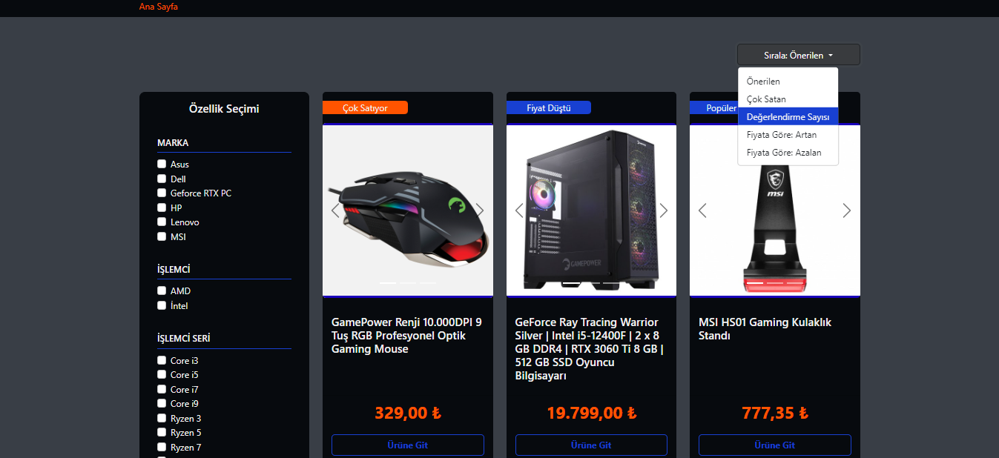

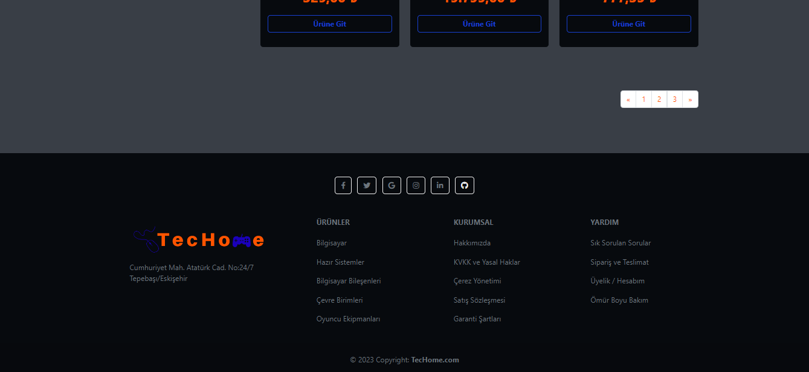

#### Ürün Detay

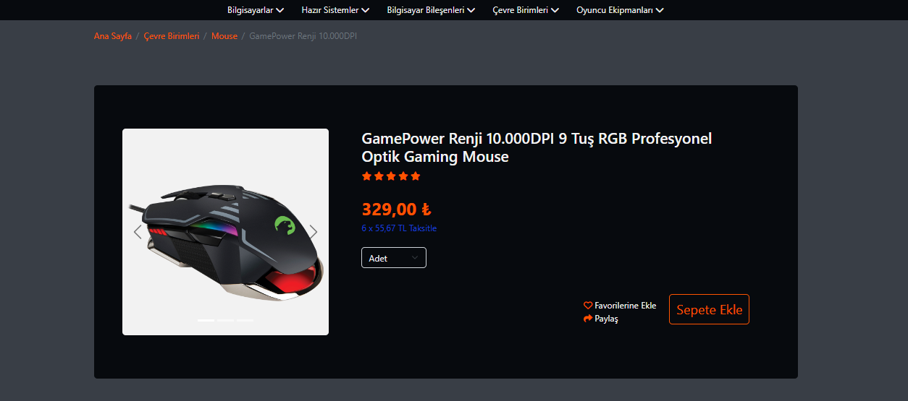

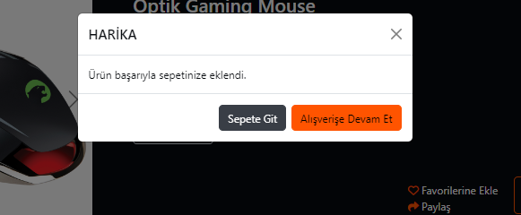

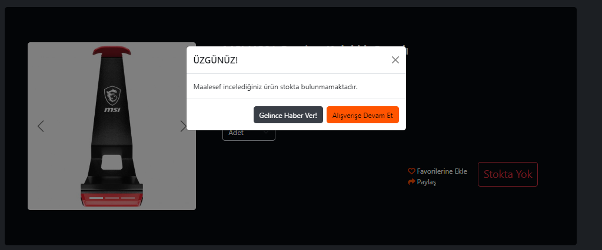

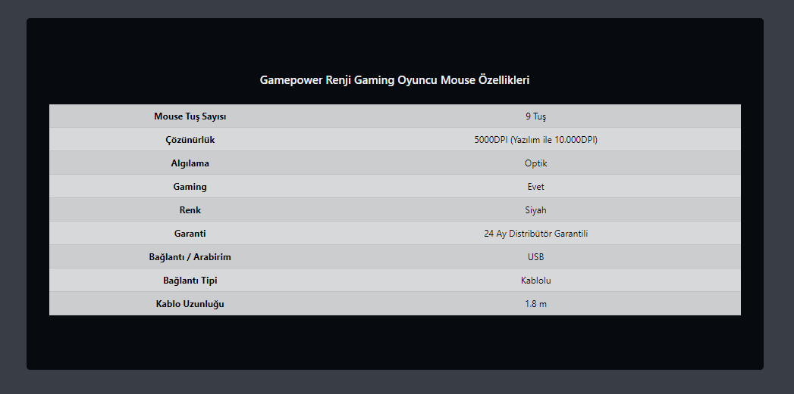

#### Sık Sorulan Sorular

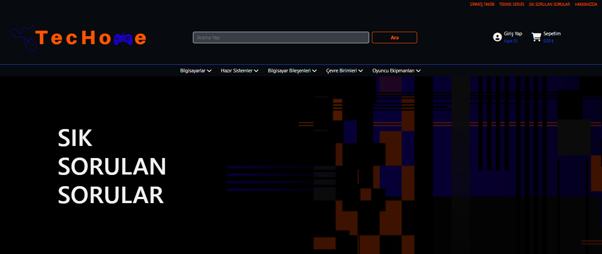

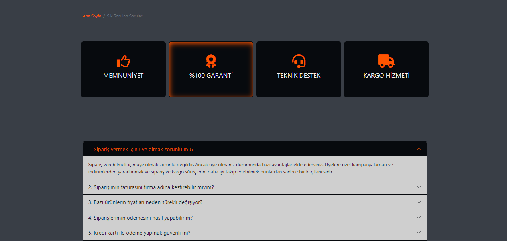

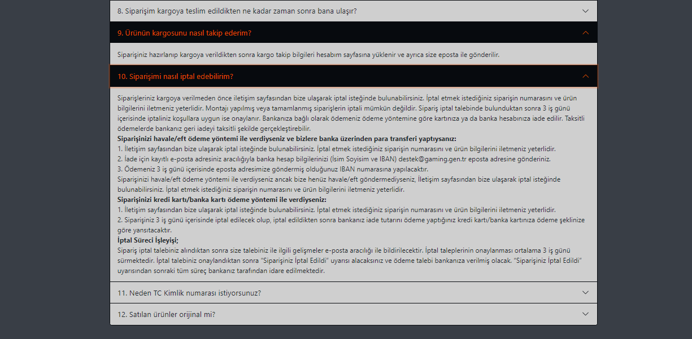

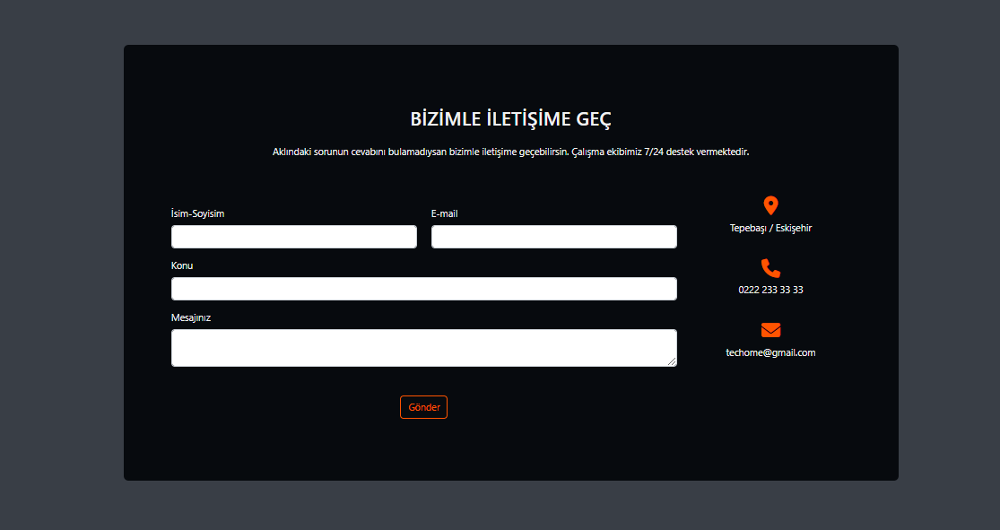

#### Hakkımızda

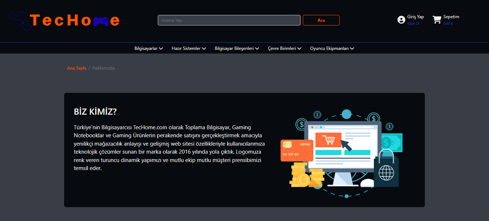

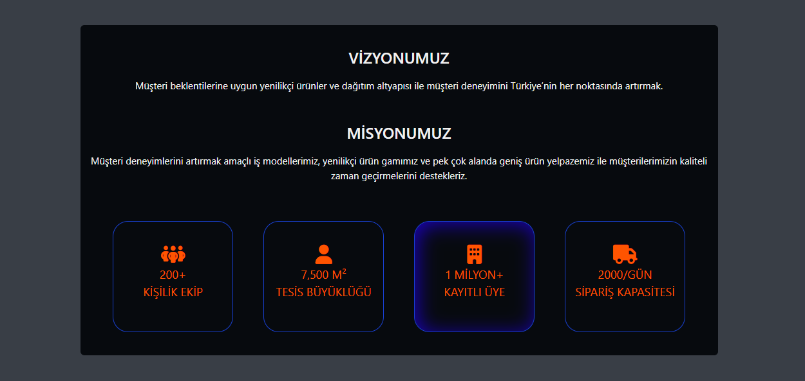

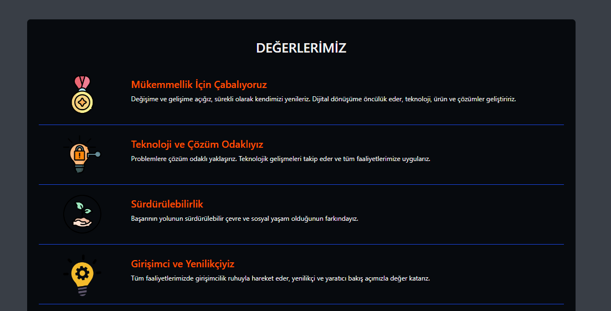

#### Responsive Design

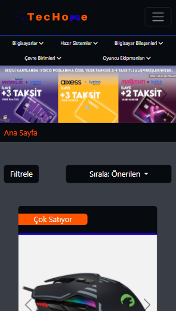

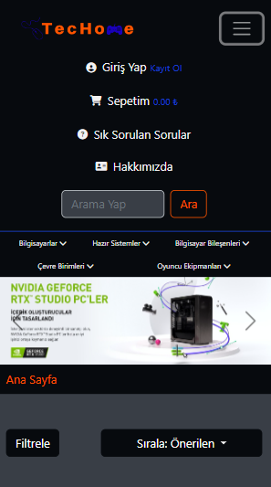

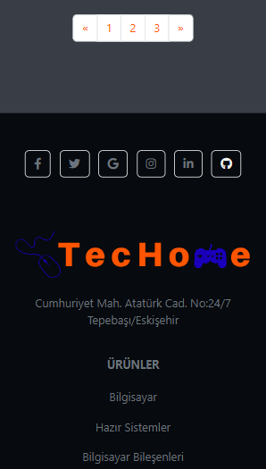

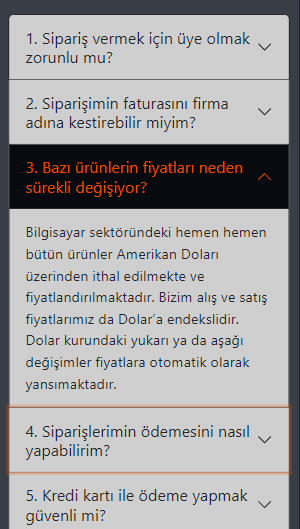

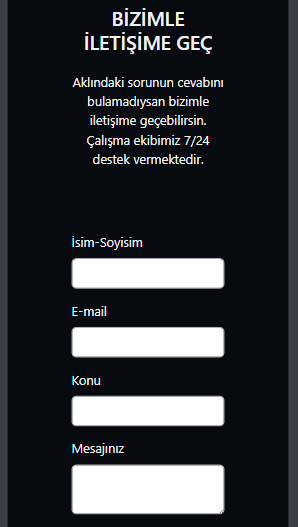

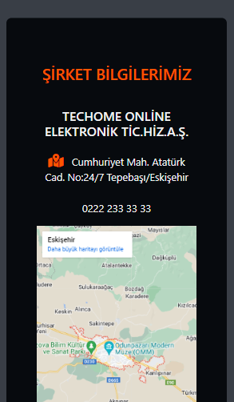
